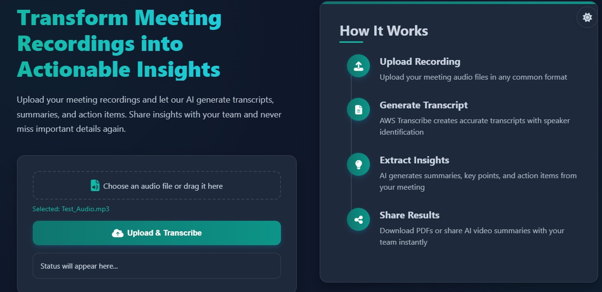
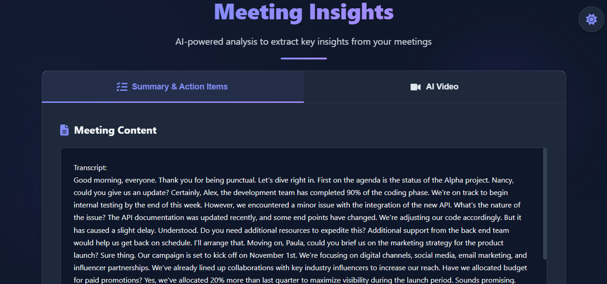
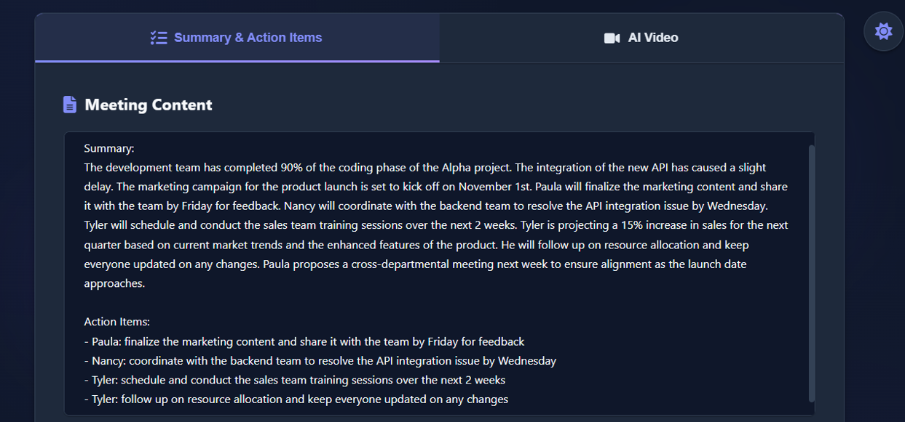
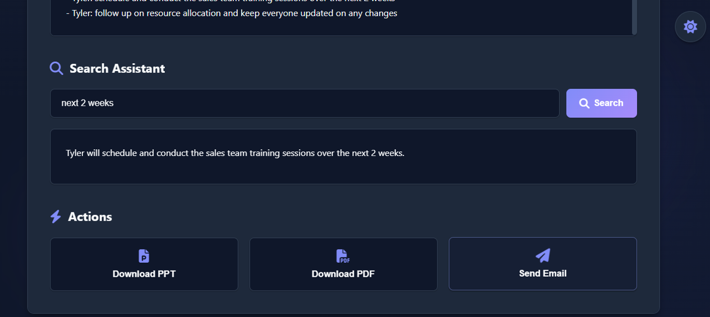
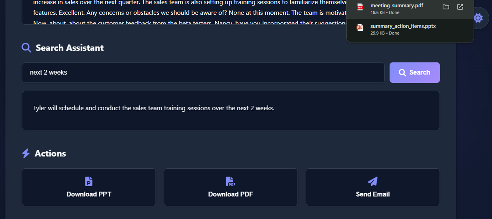
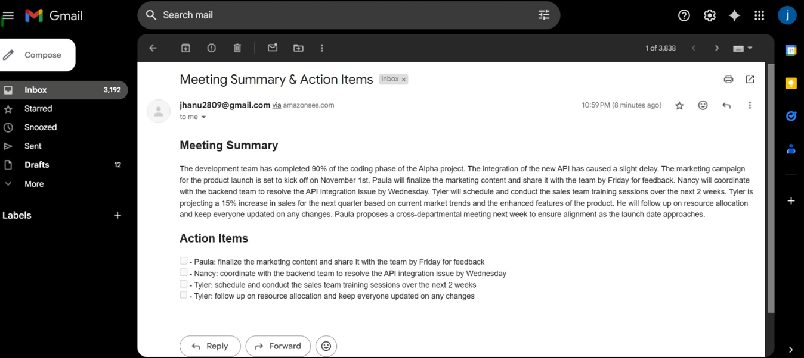
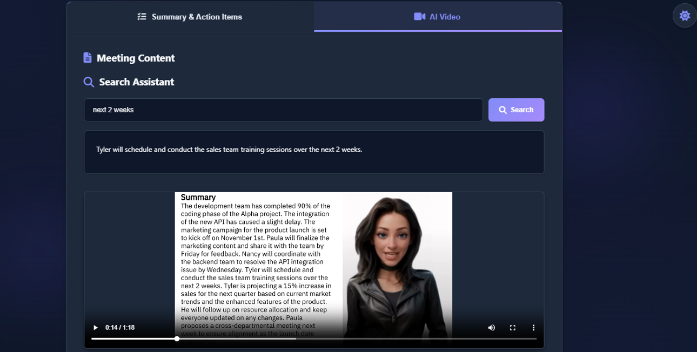
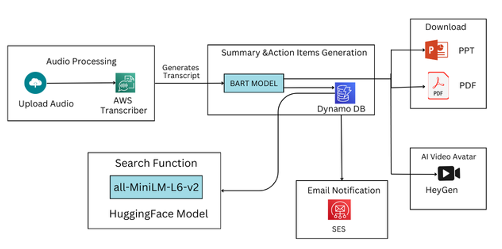

# 🤖 QuickMeet: AI for Faster Meeting Insights

 <!-- Replace with a banner image if available -->

**QuickMeet** is an AI-powered web application that transforms long meeting recordings into concise summaries, extracts key action items, enables semantic search, and delivers content in multiple formats including AI avatar videos. It is designed to improve productivity and eliminate the need for manual note-taking.

---

## ✨ Key Features

- 🎙️ **Speech-to-Text**: Converts audio/video to text using **AWS Transcribe**
- 🧠 **Smart Summarization**: Generates brief, meaningful summaries with **HuggingFace BART**
- ✅ **Action Item Extraction**: Uses **Regex and NLP** to extract decisions and responsibilities
- 🔍 **Semantic Search**: Find information using **SentenceTransformer embeddings**
- 📄 **Export Options**: Download summaries and action items as **PDF or PPT**
- ✉️ **Email Integration**: Automatically sends files via **AWS SES**
- 🎥 **AI Avatar Videos**: Presents meeting outcomes with **HeyGen**-generated avatars

---

## 🖼️ Screenshots

| Upload Page | Transcript Viewer |
|-------------|-------------------|
|  |  |

| Summary & Actions | Semantic Search |
|-------------------|-----------------|
|  |  |

| Export Options | Email Sent |
|----------------|------------|
|  |  |

| AI Avatar Video |
|-----------------|
|  |

---

## 🧩 System Architecture

The system is designed with modular components to handle end-to-end meeting processing.

 <!-- Add the actual image -->

---

## 🛠️ Tech Stack

### Frontend
- HTML5, CSS3, JavaScript (ES6+)
- Bootstrap / Tailwind CSS
- Axios / Fetch API

### Backend
- Python 3.13.2
- Flask, Flask-CORS
- Hugging Face Transformers (`BART`)
- SpaCy, NLTK
- WeasyPrint, PDFKit, python-pptx

### AI & NLP
- AWS Transcribe
- Sentence Transformers (`all-MiniLM-L6-v2`)
- Regex & Custom NLP Scripts
- HeyGen API (for avatar videos)

### Cloud Integration
- AWS S3 – for file storage
- AWS SES – for email delivery

---

## 🔄 Workflow

1. **Upload**: User uploads a meeting file (audio/video)
2. **Transcription**: Audio is transcribed using AWS Transcribe
3. **Summarization**: Transcript is summarized using BART (choice of two models based on size)
4. **Action Items**: Extracted using regex and NLP
5. **Semantic Search**: Query using SentenceTransformer-based similarity
6. **Export**: Generate PDF or PPT summaries
7. **Email & Video**: Send summaries via email or generate AI avatar video

---

## 📁 Project Structure

```bash
QuickMeet/
├── app.py
├── README.md
├── templates/
├── static/
│   └── images/
│       ├── upload.png
│       ├── transcript.png
│       ├── summary.png
│       ├── search.png
│       ├── export.png
│       ├── email.png
│       └── video.png
├── utils/
│   ├── email_sender.py
│   ├── nlp_processing.py
│   ├── pdf_generator.py
│   ├── ppt_generator.py
│   ├── transcriber.py
│   ├── video_generator.py
│   └── semantic_search.py
└── requirements.txt
